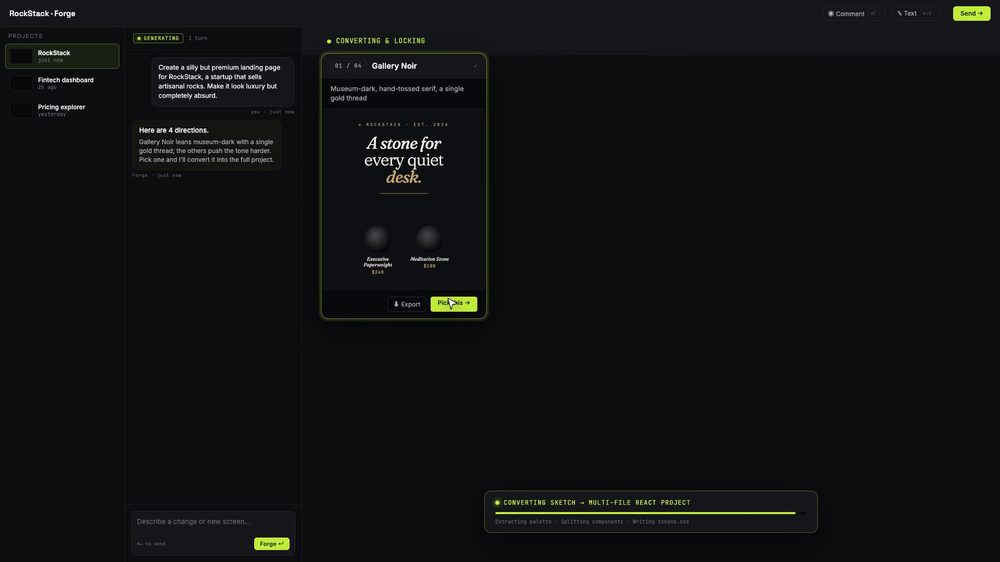
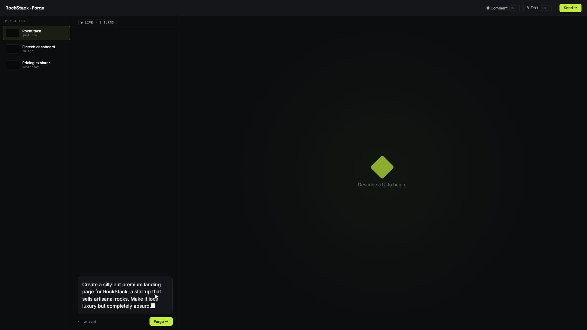

# Forge Design Studio

Forge is an AI design application. The left panel contains the conversation. The right panel contains the live design.

You can change the theme, color, density, and font. You can also select an element and add a comment pin.

Forge supports OpenAI and Anthropic models. You can select a different provider and model for each work phase.

## Interface



The conversation, design directions, and generated files stay in one workspace.



## Start Forge

1. Install the dependencies.

   ```bash
   npm install
   ```

2. Copy the environment example.

   ```bash
   cp .env.local.example .env.local
   ```

3. Add a key for each provider that you use.

4. Start the development server.

   ```bash
   npm run dev
   ```

5. Open the address that Next.js shows.

## Select the models

| Variable | Default | Purpose |
| --- | --- | --- |
| `ANTHROPIC_API_KEY` | None | Gives access to Anthropic |
| `OPENAI_API_KEY` | None | Gives access to OpenAI |
| `FORGE_DESIGN_MODEL` | `anthropic:claude-opus-4-7` | Makes design plans |
| `FORGE_CODE_MODEL` | `anthropic:claude-sonnet-4-6` | Makes the full implementation |
| `FORGE_EDIT_MODEL` | `anthropic:claude-haiku-4-5` | Makes small changes |

Use the `provider:model-id` format:

```dotenv
FORGE_DESIGN_MODEL=openai:gpt-5.6
FORGE_CODE_MODEL=anthropic:claude-sonnet-4-6
FORGE_EDIT_MODEL=openai:gpt-5.6
```

Forge does not limit the model ID. Thus, you can select a new GPT or Claude model without a source-code change.

You can also set the provider and model in separate variables. Read [`.env.local.example`](.env.local.example) for all options.

## Data flow

1. The browser sends the conversation and control values to `POST /api/chat`.
2. The server selects the provider for each work phase.
3. Forge uses the OpenAI Responses API or the Anthropic Messages API.
4. The model returns the Forge response protocol.
5. The protocol contains `<reply>`, `<design_plan>`, `<files>`, and `<edits>` channels.
6. Forge puts the HTML in a restricted iframe.
7. The controls change CSS variables in the iframe.
8. Forge saves each version in browser local storage.

## Export a design

Select **Send to Claude Code**. Forge makes a ZIP file with this name:

```text
forge-handoff-<project>-<timestamp>.zip
```

The ZIP file contains these files:

- `CORE.html`
- `design-tokens.css`
- `components.json`
- `PROMPT.md`
- `handoff-instructions.md`

Put the files in a location that Claude Code can access. Then, paste the generated prompt into Claude Code.

## Technology

Forge uses Next.js 15, React 19, TypeScript, the OpenAI SDK, the Anthropic SDK, and JSZip.

## Contributions and security

Read [CONTRIBUTING.md](CONTRIBUTING.md) before you submit a change. Report security problems as specified in [SECURITY.md](SECURITY.md).

## License

Forge uses the [PolyForm Noncommercial License 1.0.0](LICENSE.md). The same license applies to Orchestra.

You can use Forge for evaluation, education, personal projects, and nonprofit work. Business use requires written permission and separate terms from [One Man Labs](https://www.onemanlabs.org/).
